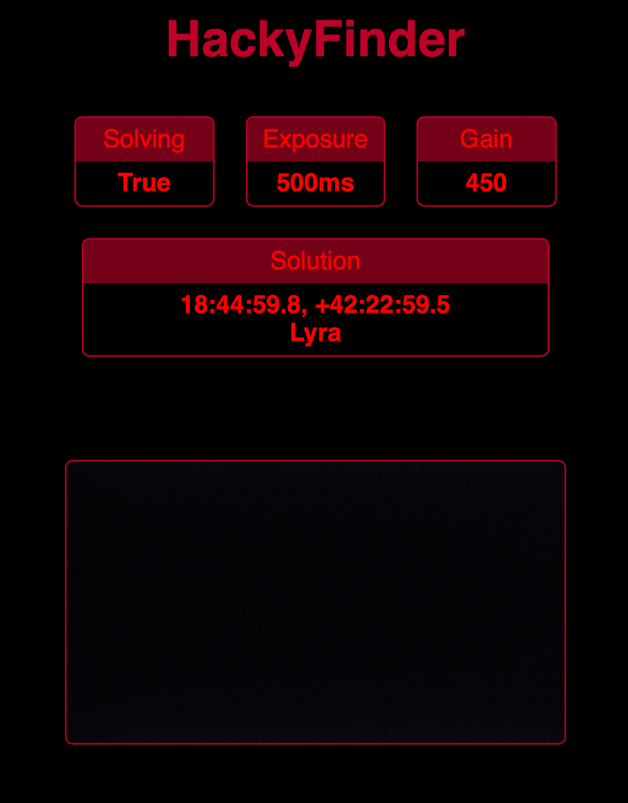
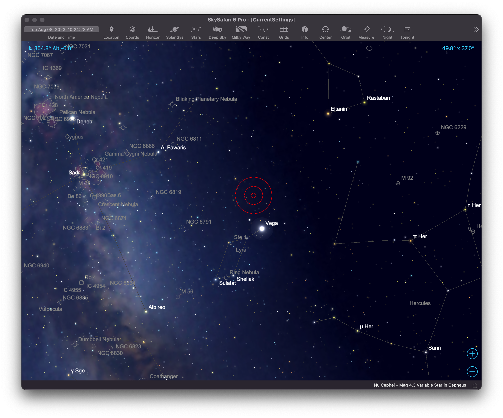

# HackyFinder

This is a *super hacky* plate solving finder for your telescope. There are similar projects out there, but I couldn't find one that worked well with the equipment I had on hand, namely an ASI camera. This will solve images, provide a simple web interface, and emulate an LX-200 to connect with SkySafari.

 

My setup:

* Raspberry Pi 4 running Astroberry
* ASI 385MC Camera + SVBONY 30mm Guide Scope
* SkySafari on iOS

I'm using Astroberry on a Pi4, but this should work on other similar systems.

### Requirements

* Python 3
* The ASI camera SDK: https://www.zwoastro.com/downloads/developers
* AstroPy and zwoasi:
	* pip install astropy
	* pip install zwoasi
* Astrometry.net command line tools, pre-installed with Astroberry: https://astrometry.net
	* You'll also need indices that match your camera field of view. Find your field of view by solving an image first: https://nova.astrometry.net
* Image Magick
	* sudo apt install imagemagick

### Installation

Clone this repository onto your Pi, then edit parameters at the top of HackyFinder.py:

Set the path to your ASI SDK to the asi.init line, making sure to use the correct ARM version:

	asi.init('/home/astroberry/ASI_linux_mac_SDK_V1.30/lib/armv7/libASICamera2.so')

Set camera and solver options:

	image_type = asi.ASI_IMG_RGB24 # asi.ASI_IMG_RAW8, or asi.ASI_IMG_RAW16
	exposure = 500 # ms
	gain = 450

	# Solver settings
	scale_low = 1.83
	scale_high = 3.24
	downsample = 6

HackyFinder calls out to astrometry.net for solving, so you may want to adjust the entire solve command in the solve_images() method. Test the command outside of HackyFinder with different indices and settings until you get the fastest possible solves for your specific setup, then update the command to match.

The web interfaces shows your exposure settings, solving status, and the captured image. When not solving, it will show a target to help align your finder scope.

Since Astroberry already has a running web server, I'm just generating the status page and placing it there. If you'd like it to live somewhere else, adjust the path in the write_html() method.

For Astroberry, do the following:

	sudo mkdir /var/www/html/finder
	sudo chown astroberry.astroberry /var/www/html/finder
	sudo ln -s styles.css /var/www/html/finder

This will create a directory in the standard Astroberry web directory, give permission for HackyFinder to write there, and link the stylesheet.

When running, view the status page at: http://astroberry.local/finder

### How to use

Once you have all of the settings configured, have your camera connected, and have clear skies, you can run HackyFinder:

	python3 HackyFinder.py

You'll want to setup your Pi to run this on boot, but for testing you'll probably start it manually.

Assuming everything is connected, you should see it start the LX-200 server and start capturing images. It will default to "not solving," which will show a target on the captured images in the web interface, which refreshes every few seconds. It's not fancy, so sometimes the image won't appear because it's in mid-capture.

Launch SkySafari, and setup a telescope connection to your Pi's IP address and the port specified in the file, which is 5005 by default. Set the telescope type to LX-200 GPS over wifi or ethernet.

Once connected, SkySafari should display the current solved position, or 0, 0 if it hasn't solved yet.

#### Controls

Since we're not connected to a real mount, I've hijacked the slewing and speed controls to control HackyFinder:

* Slew speed 4: enable solving
* Slew speed 1: disable solving
* Slew N: Increase exposure by 500ms
* Slew S: Decrease exposure by 500ms
* Slew W: Increase gain by 50
* Slew E: Decrease gain by 50

You'll sometimes need to toggle between slew speeds 1 and 4 if SkySafari is already on one or the other. SkySafari will also occasionally loose connection or get laggy when making adjustments, but you should be able to just reconnect. Watch the status page to see your changes.

To align your finder, disable solving by going to slew speed 1. A red target will appear on the captured image. Point your telescope to a bright star, then adjust your finder to place it inside the target. Switch back to solving by going to slew speed 4.

Depending on your equipment and tuning you can solve within a few seconds. Just make sure to let go of the scope so it can capture a clean image.

